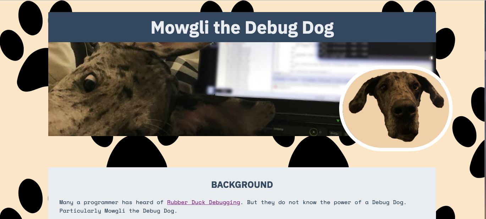
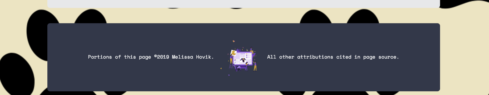
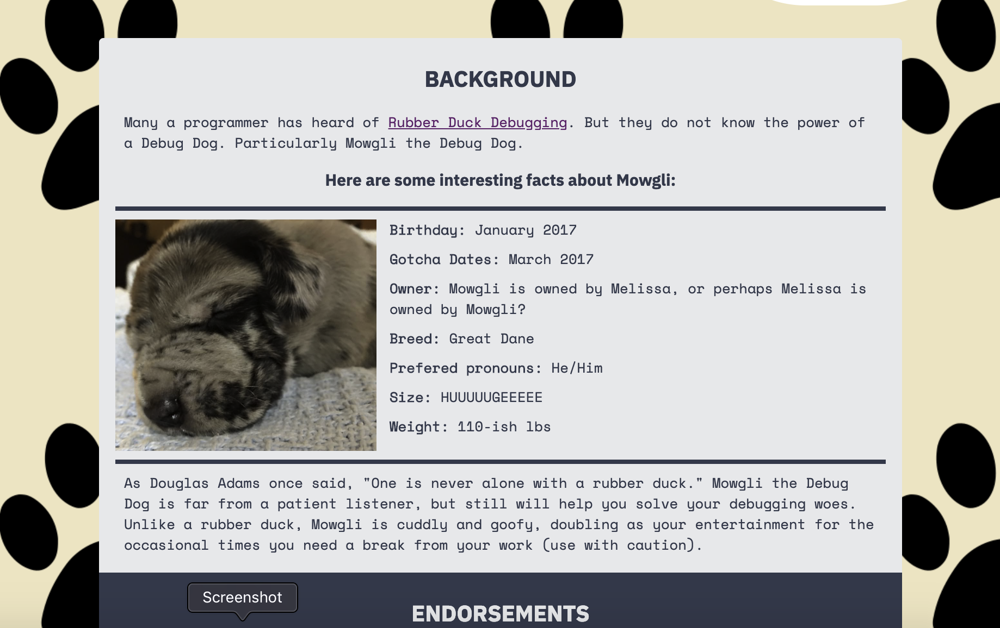
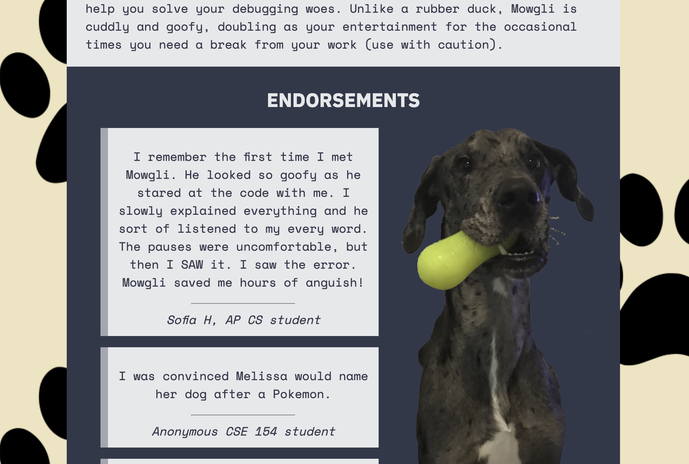

  # Homework 1 - Debug Dog Portfolio -  Project Specification
## Overview
It can be advantageous to create a portfolio website, whether you are looking
for an internship or a job or you are interested in sharing work you’ve done
with a broader audience. In this assignment you will practice creating a portfolio page
not for yourself, but instead for Mowgli, our class mascot and an all around great Debug Dog.

Ultimately the goal of the assignment is for you to demonstrate your understanding of
Module 1: HTML and CSS. This is also your first assignment where you are expected to follow
a more structured **Homework** specification (as opposed to the Creative Project
Specifications) for CSE 154.

<p>
  
</p>

## Learning Objectives
* Practice following CSE 154 assignment specifications, and more broadly, webpage specifications
given a PDF and/or other visual and text-based artifacts as a design basis.
* Write your webpage using HTML and CSS:
  * Choose appropriate HTML tags with an understanding of the semantic meaning of each tag and the
  context they are used in a webpage.
  * Use CSS properties to style a webpage to match a given specification.
  * Use ids and classes appropriately.
* Produce quality readable and maintainable code that conforms to class standards:
  * Separate content and structure (written in HTML) from your style (written in CSS).
  * Be able to test that your webpages are valid and conform to HTML and CSS standards.
  * Reduce redundancy in your CSS by using context- and/or psuedo-selectors in your code.
  * Demonstrate understanding of the CSE 154 code quality expectations modeled in lectures,
  sections, labs, and in the course's official Code Quality Guide.
* Use GitLab to maintain personal source code and turn in an assignment.

## Starter Files and Final Deliverables
In this HW1 repository you will find the following starter files:

| File/folders&nbsp;&nbsp;&nbsp;&nbsp;&nbsp;&nbsp;    | Description |
|----------------|------------------------------|
| `debugdog.html`     |  The partially complete HTML file for Mowgli the Debug Dog's profile page. |
| `style.css`     |  The starting stylesheet with a single provided ruleset as well as a region specified for your "Creative Section" styles. Replace all TODOs with the CSS for this assignment, and **do not** change anything else. |
| `img`          | A folder with images of Mowgli that are needed to replicated the page, as well as extras for use in the "Creative Section". |
| `screenshots`  | A folder with some reference screenshots in this `README.md` (more screenshots of the expected rendered page on different browsers are [here](https://courses.cs.washington.edu/courses/cse154/19sp/homework/hw1/screenshots/)) |

Your final repository should be submitted with the following files:

| File/folders&nbsp;&nbsp;&nbsp;&nbsp;&nbsp;&nbsp;    | Description |
|-------------|------------------------------|
| `debugdog.html` | The **completed** HTML file for the Debug Dogs profile page |
| `style.css`  | The **completed** stylesheet for `debugdog.html` |
| `img`  | All original images and **optionally** _up to two_ additional images you wish to add to the project for the creative section |
| `screenshots`  | **unchanged** |

 **Note:** You will only be changing certain parts of the provided HTML file (inside the `head`, the
"Endorsements" and the "Creative" `section`s). You are **not to change any other part of the
`debugdog.html` file**. You will be graded on these allowed changes and your completed `style.css`
file. Any disallowed changes you make to `debugdog.html`, `style.css`, or the other provided files will not be eligible for full credit.

## Structure of Starter HTML
* The given `debugdog.html` already contains some of the structure for your content, including a
`header`, a `main` area, and a `footer`. **Note:** For full credit, you are not to change any of
the HTML in the `header` and `footer`.
* Within the `main` area of the page, there are three primary sections (some of which may have nested
  sections):
  * `<section id="background">` - this section contains content and structure for the background information
  of Mowgli's profile page. **Note:** For full credit, you are not to change any of the HTML within this tag.
  * `<section id="endorsements">` - this section contains the content but not the HTML structure
    for the endorsements. You will be adding the HTML for this text content with HTML.
  * `<section id="creative">` - this section is completely empty to start. You will be adding both your
  own unique content to this part of the page as well as the HTML for structure.

Details on how you are to modify `<section id="endorsements">` and `<section id="creative">` will
be detailed in their respective sections below.

## External Requirements
This section will describe the external "look and feel" of your webpage. For full credit, your
solution should adhere to *both* the visual references
([screenshots](https://courses.cs.washington.edu/courses/cse154/19sp/homework/hw1/screenshots/)) and text specifications, and
you may not add styles (outside of the creative section) that are unspecified (e.g. setting a
font size that is never mentioned). If you
think the specification is missing a requirement, make sure to review both text-based and visual
guides and also confirm that the
requirement isn't covered implicitly by another requirement.

### Sample Screenshots
Although you do not need to match the output pixel for pixel, we find it is helpful for students to
know on what system each screenshot came. Example screenshots for a sample profile
for Mowgli the Debug Dog's page are included in the course website's hw1
[screenshots](https://courses.cs.washington.edu/courses/cse154/19sp/homework/hw1/screenshots/) directory.

### Text Description of Requirements
For full credit your webpage must have the following:

#### Page Body
* The page body should have a width of `80%` and should be centered horizontally on the page.
* The background image of your page should be set to `img/dog-footprint.png` and should be repeated
  across and down the page. The background image should not appear to scroll as the page scrolls (i.e. it should be a fixed image).
* The background color of the page should be `#FEE8C8`.

#### Thematic Page Styles (Colors and Fonts)
* **Note**: These thematic styles may be overridden for your creative section
* The page will use two imported Google fonts:
   * IBM Plex Sans (customized with the "bold 700" option) which will be used for all headings, defaulting
   to a sans-serif font if this is not available.
   * Space Mono which will be used for the rest of the body text, defaulting to a monospace font if this is not
   available.
   * Remember, **Google fonts must be imported at the top of the CSS file**.
* The top-level heading, endorsements heading, and the footer should have a background color of `#34495E` and the text of these elements should have the color of `#EBEDEF`.
* The default font color of page links should be `purple` but visited links should have a font color set to `midnightblue`.
* Any other elements in the `main` section should have a background color of `#EBEDEF` and font
  color of `#34495E` (remember to review the screenshots to check you have the correct background
  and foreground colors on the right elements).

#### Common Heading Styles
* The text of all headings on the page should be centered horizontally.
* All second-level headings should have upper-cased text with a font size of `1.6em`. *Note:* DO NOT change the HTML to achieve the upper-casing, this can be done with a transformation of the text in CSS.

#### `header` Requirements
* Refer to screenshot at the top of this spec for the `header` appearance (from Chrome on Mac)
* **Remember**: You are not to change the HTML of the provided `header` section.
* The height of the header should be set to `350px`.
* The background image of the header should be `img/header-background.png`. This image should be centered in the header with a background size of `100%` and should **not** repeat in any direction.
* The heading in the header should have the following properties:
  * The text should have a font size of `3.1em`.
  * There should be `10px` of padding on all sides.
  * The top right and top left border radius should be `5px`.
* Mowgli's profile photo in the header should be styled as follows:
  * The image should have a width of `300px` and a height that is set to `100%` to maintain width/height
    ratio.
  * The border of this image should be solid, white, and `10px` in width.
  * The border radius of the image should be `200px`.
* The `div` with the id `#profilepic` surrounding Mowgli's profile picture should have a top padding of `3%` and a left padding of `75%`.

### `footer` Requirements
<p>
  
</p>
* **Remember**: You are not to change the HTML of the provided `footer` section
* The page footer should have `20px` of padding on all sides and a border radius of `5px`.
* The paragraph text in the footer should have a font size of `1vw` (note the units!) and should be centered horizontally.
* The image inside the footer should have:
  * A height of `70px`.
  * A vertical alignment (relative to the text in the footer) set to the middle.
  * A right margin of `10px`.

#### `main` Requirements
* The `main` element should have a top margin of `8%`, a bottom margin of `4%`, and a border
  radius of `5px`.
* All three sections nested directly in `main` should have top/bottom padding of `1%` and
  left/right padding of `2%`.
* In order to make the sections in the main section appear correctly we have provided the following
 rule set to the starter `style.css` file which you should not remove. **Note**: We will be
 learning about Flexbox prior to turning in your assignment, but this assignment does not
 require its use other than this one line. You *may* choose to use Flexbox in your Creative
 Section (see below), however if you do choose to use it you will be graded according to its proper use.

 ```
.side-by-side {
  display: flex;
}
 ```

##### `<section id="background">`
<p>
  
</p>

* All paragraphs within this section have `10px` of margin on all sides.
* The `#facts` section should have top and bottom borders that are solid, `5px`, and have the color `#34495E`.
* The image in the `#facts` section has a width of `300px` and a height set to `100%` to maintain width/height ratio. The image should have also have `5px` of margin to the right, no margin on the left, and `10px` of top/bottom margin.

##### `<section id="endorsements">`
In this section we have only provided you the content, so you are to create the structure of this part of the page as well as defining the style.

<p>
  
</p>

###### Structural Requirements
* The word Endorsements should be this section's level-2 heading.
* The section has one container which should be given the class `side-by-side` (this class will be used to ensure
   the picture of Mowgli is to the right of all of the endorsements). Within this container should be another container on the left
   (on the left) with all of the endorsements and then the puppy image of Mowgli located at `img/goofy-dog.png`. Note that you have flexibility in how you interpret "containers" here, as long as you are using semantic tags appropriately and take care to avoid unnecssarily deep nesting of tags.
* Each endorsement can be represented as a "card" UI element with three parts: a block-level quote
  containing the endorsement paragraph(s), followed by a horizontal rule, followed by the citation
  for the endorsement quote. **Hint: Refer to CP1's `about.html` starter template to help structure
  each endorsement quote!**
* One endorsement (with Tal Wolman as the cited author) has a link to another page which you should
  markup with HTML appropriately. As noted in the source code, the text pointing to this page is
  "advice". The link URL should not be visible on the page. Refer to the screenshots for expected
  appearance.

###### Appearance Requirements
* The image within this section should have a default width of `30vw` but with the maximum width capped at `400px` (the order of the rules matter!). The height of this image should be set to `100%`.
* Each endorsement card should have the following properties:
  * All text should be centered horizontally within the endorsement card.
  * The left border should be solid with the color `#AEB6BF` and a width of `10px`.
  * The card should have `30px` of left and right margin and `15px` of margin on the bottom. There should be no margin on the top of each card.
  * There should be `10px` of spacing between the any text of the card and the top/bottom borders of the card. Remember that some tags have
    default spacing, so you may need to override the defaults if needed (though do so only if
    necessary).
  * The horizontal rule has a width of `40%` relative to the width of the card.
  * The font style of the citation should be italic.

##### `<section id="creative">`
Your creative section should follow the theme of the page body but include its own unique content, structure, and style.

**Note:** it is expected that the work you do for this project be new and unique.
Thus we do not want you to re-use work you did for your CP1 solution. Similarly, any selectors or styles
specified elsewhere in this spec will not count towards the requirements for this section. To
complete this part of the assignment, you are to add your CSS in the region specified in
`style.css`. Keep this region at the bottom of the CSS file.

##### Content and Structural Requirements
* The creative section must include one image tag. You may choose from one of the extra images
included in the `img` directory (`mowgli1.png` .. `mowgli8.png`), or you may upload *up to 2* of your own to that same directory to use.
* The creative section must include the following:
  * At least one appropriately-used semantic tag such as `article`, `section`, `aside`, `figure`,
  `figcaption`, `summary`, `details`, or `time`. **Note**: `nav`, `main`, `header`,
  and `footer`, while semantic tags, do not make sense in this context. The HTML5 semantic tags
  are listed [here](https://www.w3schools.com/html/html5_semantic_elements.asp)
  * At least two different heading levels (appropriately chosen).
  * A minimum 1-2 paragraphs of text.
  * A nested list using either `ol` and/or `ul` tags.
  * An appropriately-used inline tag (e.g. `a`, `em`, `strong`, `span`) for a small region of your text.
* You may include ids and classes as needed, but do not overuse them (remember to refer to lecture slides and the Code Quality Guide for how/when to use these).

##### Appearance Requirements
* You must demonstrate the use of the box model (margins and padding) somewhere within the
styling of the creative section.
* You are to use at least 3 CSS selectors that are uniquely used in this creative section. Refer to this
[page](https://developer.mozilla.org/en-US/docs/Web/CSS/Reference#Selectors) for a CSS
reference of selectors. The selectors must be different than any selectors in `style.css`.
* You must apply at least 5 unique CSS rules to content in your creative section. Recall
a rule is a property: value pair, so for two rules to be unique both the property and the value
must differ. (i.e. `color: blue`; and `color: green`; are **not** considered two unique rules.)
  * At least three of these properties must be different (i.e. you can use three `color` properties
    and two other different properties to satisfy this criterium).
* Any text in this section must be readable (for example, consider a solid background color to distinguish
text from the pawprint background of the page body).
* You may use Flexbox layout in this section, though it is not required and will be graded on appropriate use (you can refer to [MDN](https://developer.mozilla.org/en-US/docs/Web/CSS/CSS_Flexible_Box_Layout/Basic_Concepts_of_Flexbox) and lecture slides for appropriate use, and you are free to ask about it more in office hours!).
* **Reminder**: While the CSS from other parts of this assignment may affect the appearance of the creative
  section, only new CSS properties will satisfy the requirements of this part.
* For full credit, your added styles in the Creative Section **must not change the appearance of the rest of the page**. Remember to use context selectors to narrow the set of elements you want to style.

## Internal Correctness Requirements
For full credit, your page must not only match the external "look and feel"
requirements listed above, you must also demonstrate that you understand what
it means to write code meeting the standards expected by this class. This
includes the following "Internal Correctness" requirements:

* Your `debugdog.html` file must link to `style.css` in the head of the page.
* You may not use any HTML/CSS frameworks for this assignment.
* All of the work added to the repository must be your original work, you may not collaborate with any other students on this assignment.
* Your HTML and CSS files must be well-formed and successfully pass W3C HTML5 and W3C CSS3 validators with no errors (warnings are ok). Links to these validators can be found on the course website's [resources page](https://courses.cs.washington.edu/courses/cse154/19sp/resources/resources.html#validators).
* Do not express style information in the HTML, such as inline styles or presentational HTML tags such as ```<b>``` or ```<font>```.
* Do not use any deprecated HTML tags listed on [this page](http://www.tutorialspoint.com/html5/html5_deprecated_tags.htm).
* Use HTML5 organizational tags such as ```article```, ```section```, and ```aside``` to divide sections appropriately with semantic meaning.
  * You may still use the ```div``` tag for dividing your creative portion, but as discussed in lecture "```div``` should be your last resort when an element has no semantic value".
* Prefer organizational tags and CSS selectors over ids and classes when appropriate.
* Use `h1`-`h6` heading tags as appropriate. Do not skip heading levels in your page to get smaller headings (use CSS instead if desired).
* Express all stylistic information on the page using CSS defined in `style.css`. A large portion of the points for this assignment will be for CSS.
* Part of your grade comes from expressing your CSS concisely and without unnecessary or redundant
  styles. For example, the content block shares many (if not all) styles in common, so you should
  not specify those styles twice in your CSS file. Similarly, use context selectors to avoid needing to apply classes and ids to large numbers of elements.

## Style and Documentation
* Your HTML and CSS should be readable and demonstrate good code quality as demonstrated in class and
  detailed in the [CSE 154 Code Quality Guidelines](https://courses.cs.washington.edu/courses/cse154/codequalityguide/_site). Part of your grade will come from using consistent indentation,
  proper naming conventions, curly brace locations, etc.
* To keep line lengths manageable, do not place more than one block element on the same line or begin a block element past the 100th character on a line. Remember to use softtabs (spaces) not tab characters.
* Place a comment header in each file with your name, section, a brief description of the assignment, and the files contents. Examples:

    HTML File:

    ```
    <!--
         Name: Mowgli Hovik
         Date: September 30, 2018
         Section: CSE 154 AB
         This is the index.html page for my portfolio of web development work. It includes links to side
         projects I have done during CSE 154, including an AboutMe page, a blog template, and
         a crytogram generator.
    -->
    ```

    CSS File:

    ```
    /*
        Name: Mowgli Hovik
        Date: September 30, 2018
        Section: CSE 154 AB
        This is the index.css page for my portfolio of web development work.
        It is used by all pages in my portfolio to give the site a consistent look and feel.
    */
    ```

## Development Strategies
We suggest you tackle this project in the following order:

1.  Start by creating your `style.css` file, then add the link to the `debugdog.html` file to
connect these two together.
2. Carefully read this [Page Body](#page-body) section of this specification and add
 and add appropriate selectors and rules to `style.css` to style the page
 appropriately.
3. Next, tackle the three content areas of the page where you are not to change the
 HTML, but only add selectors and rules to your `style.css` file. The order you tackle these doesn't
 really matter, but we would suggest:
   1. Do the `header` first
   2. Next do the `footer`
   3. Followed by the `<section id="background">`
4. Read and think about the structure of the endorsements part of the page. What tags are the
most appropriate for this content? Add the tags to the `debugdog.html` file, then add appropriate selectors and rules to `style.css` for those tags.
5. Create your own content for the creative section. You may wish to sketch some ideas out
by creating a "wireframe" of this part of the page before you start to implement it.
  * Something that may help is the section "How to wireframe?" from [Jezmin Gonzales’ Assignment
  3: Wireframes Basics of the Internet, Design Methodology, Assignment 2 Review](https://jesmingonzales.wordpress.com/2012/02/27/assignment-3-wireframes-basics-of-the-internet-design-methodology-assignment-2-review/)
  * Add your content and structure (HTML) to the `debugdog.html` file
  * Add your selectors and rules to the `style.css` file
6. Once you are done with all of your development, look at your selectors and see if you have
any duplication. Group your CSS selectors that use that duplicate rule. You can use the Chrome
Inspector to "uncheck" styles to see if you have any unused/duplicated styles at this point.
7. Remember to make sure you have validated your HTML and CSS!

### Development Environment
* As with all development projects, we recommend that you create a new folder for this
 project that is separate from other work you will create for this course this term.
* Make sure you are saving your files often!

#### Git
We recommend that you commit your changes to your GitLab repository OFTEN
and with descriptive commit messages. Once you save your files, remember in
your git shell or terminal type the commands
`git add <filename>` then `git commit -m "<add your descriptive message here>"` then `git push origin master`.

#### Debugging Tools
We strongly recommend that you use the Chrome Inspector on this assignment. This will help you see the rendered styles of each element! You will also want to become familiar with it as early as possible, as it will become particularly useful for debugging JavaScript in future assignments!

## Grading
This HW will be out of 20 points and will roughly (subject to small adjustments) be distributed as:
* External Correctness (7 pts) - The external requirements listed in this document are met.
* Internal Correctness (10 pts) - The internal requirements listed in this document are met.
* Style and Documentation (3 pts) - The style and documentation requirements in this document are met.  

### Meeting Webpage Content Standards

#### School Appropriateness of Content
Recall that one of our course policies is to engender an [inclusive environment](https://courses.cs.washington.edu/courses/cse154/19sp/syllabus/syllabus.html#inclusion). As such it is important that you are thoughtful about what you choose to post on your page. Please make sure that the images and text you are using are "school appropriate" and follow the guidelines of expected behavior. If you have any questions, please do not hesitate to ask a TA or your instructor.

#### Copyright and Citations
For the Creative Section of this assignment, you may include additional images. However, you must have the right to publish any added images. This means you may only use:
* Media you have created or generated yourself (i.e. pictures you have created or taken yourself, text you have written yourself.)
* Images that are in the public domain (something from Wikipedia), or something with a creative commons license that allows for reuse without explicit permission of the owner.
  * [Creative Commons Kiwi](https://creativecommons.org/about/videos/creative-commons-kiwi/) is a really informative video on Creative Commons licensing.
  * Instructions on how to search for images that are fair use are [here](https://support.google.com/websearch/answer/29508?hl=en).
  * You must cite any works that you use that you did not generate yourself (although technically you only need to cite things that are [CC: attribution](https://creativecommons.org/licenses/by/2.0/)).
  * A handy site for knowing how to add your citations is [here](https://wiki.creativecommons.org/wiki/Best_practices_for_attribution)
* Examples of how to cite your sources in this class are [here](https://courses.cs.washington.edu/courses/cse154/19sp/code-examples/code-examples.html)

## Academic Integrity
As with any CS homework assignment, you may not place your solution to a publicly-accessible web
site, neither during nor after the school quarter is over. Doing so is considered a violation of our
course [academic
integrity](https://courses.cs.washington.edu/courses/cse154/19sp/syllabus.html#academic-conduct)
policy. As a reminder: This page page states:

  The Paul G Allen School has an entire page on
  [Academic Misconduct](https://www.cs.washington.edu/academics/misconduct) within the context of
  Computer Science, and the University of Washington has an entire page on how
  [Academic Misconduct](https://www.washington.edu/cssc/for-students/academic-misconduct/) is
  handled on their
  [Community Standards and Student Conduct](https://www.washington.edu/cssc/) Page. Please acquaint
  yourself with both of those pages, and in particular how academic misconduct will be reported to
  the University.
